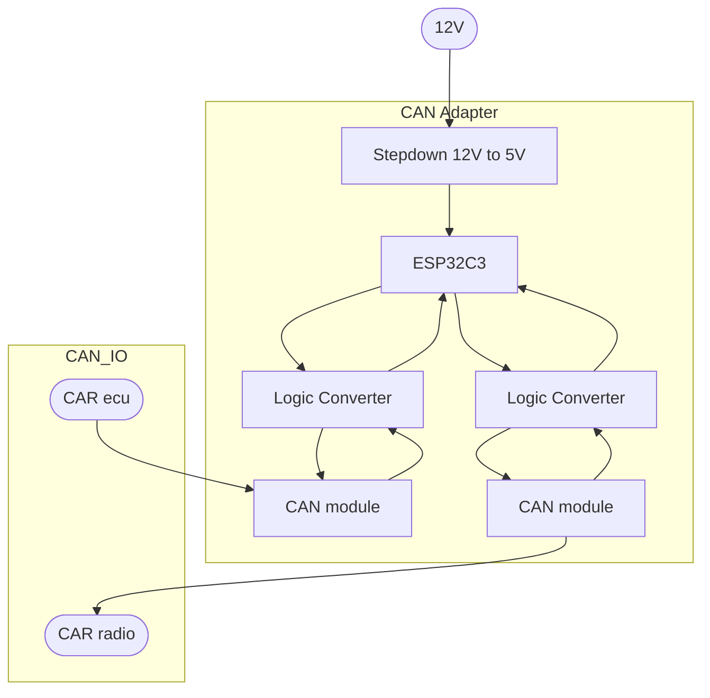

# CAN_VWTP_ADAPTER
Adapter is meant for older VW group cars (platform PQ 25) with VW TP 1.6 CAN protocol enabling them to communicate with newer radios which use VW TP 2.0 (RCD 330/340 etc.).   
This bridge was specifically built for **pre-facelift Skoda Fabia 2**, so the format of messages and their IDs may differ from car to car (VW golf, polo etc.).  

### Components
- **Radio** - RCD340G
- **Car** - Skoda Fabia mk2 (2008)
- **MCU** - ESP32C3 super mini
- **CAN module** - MCP2515
- **Logic converter** - BSS138 (5V to 3.3V and vice versa)
- **Stepdown converter** - MP1584EN (12V to 5V)

## System Architecture Overview

The adapter enables the radio to understand messages about the current state of ignition. Now the radio:
1. Turns on when the ignition is turned on. 
2. Turns off when the key is removed from the switch box.
3. Bluetooth functionality is now enabled (not functional when the radio was not receiving correct messages).
4. The radio now **does not drain the car`s battery** while unused (standby mode) and does not turn itself off after 30 minutes.   
