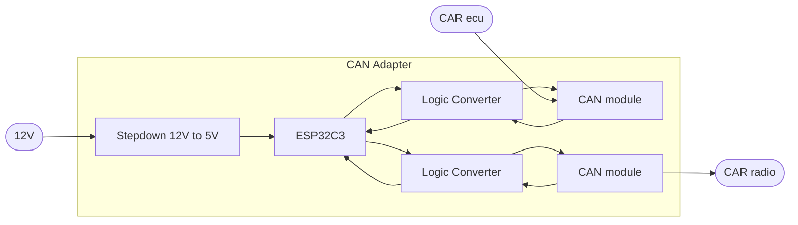

# CAN_VWTP_ADAPTER
Adapter is meant for older VW group cars (platform PQ 25) with VW TP 1.6 CAN protocol enabling them to communicate with newer radios which use VW TP 2.0 (RCD 330/340 etc.).   
This bridge was specifically built for **pre-facelift Skoda Fabia 2**, so the format of messages and their IDs may differ from car to car (VW golf, polo etc.).  

### Components
- **Radio** - RCD340G
- **Radio CANbus protocol** - VW TP 2.0 
- **Car** - Skoda Fabia mk2 (2008)
- **Car CANbus protocol** - VW TP 1.6 

- **MCU** - ESP32C3 super mini
- **CAN module** - MCP2515

## System Architecture Overview

