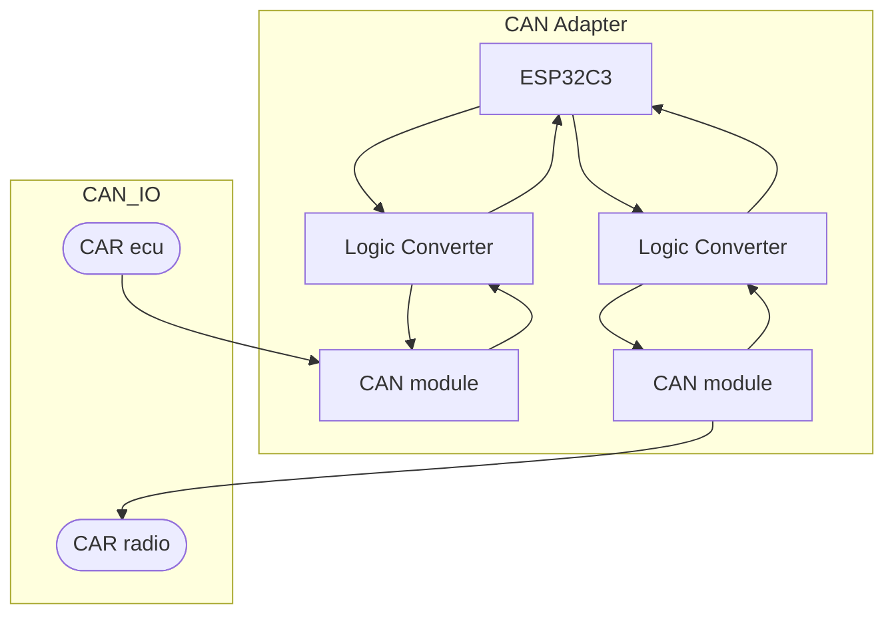

# CAN_VWTP_ADAPTER
Adapter is meant for older VW group cars (platform PQ 25) with VW TP 1.6 CAN protocol enabling them to communicate with newer radios which use VW TP 2.0 (RCD 330/340 etc.). <br> 
This bridge was specifically built for **pre-facelift Skoda Fabia 2**, so the format of messages and their IDs may differ from car to car (VW golf, polo etc.). <br>
**Note:** I had no access to VW TP 1.6 nor VW TP 2.0 protocols. This solution was built based on analysis of logs sniffed from my car's CAN bus and study of [decompiled code of chinese black box CAN converter](https://github.com/unemployable/Golf-Mk5-RCD330-CAN-Filter) and experiments with the message formats. 

### Components
- **Radio** - RCD340G
- **Car** - Skoda Fabia mk2 (2008)
- **MCU** - ESP32C3 super mini
- **CAN module** - MCP2515
- **Logic converter** - BSS138 (5V to 3.3V and vice versa)
- **Stepdown converter** - MP1584EN (12V to 5V)

## System Architecture Overview

## System Wiring


## Functionality
Turns out there was only one type of message that needed to be altered and those were the messages from ECU (with ID `0x271`) which were resetting the sleep timer (position of the key in car's ignition). The car's ECU sends messages in format: 
```
<ID> <message>
```
where the message is in following format:
`<first byte> 0x80`.
Meaning the only the first byte contains the information about the position of the key.
- `00`: The key is inserted, the first position
- `03`: Second position of the key
- `07`: Third position of the key
- `87`: The engine is running

The message then looks like:
```0x271: 00 80```.

All that was needed was to send the same message with different ID. VW group cars often use either `0x2c3` or `0x575` and in this case the radio expects messages with ID `0x575`. 

From further analysis and experiments I found out that VW 1.6 and VW 2.0 are quite similar, because the radio understands messages about the state of the headlights out of the box. The message about the state of lights (which changes the brightness of the radio's diplay and turns on the illumination of the buttons) is sent with ID `0x635` in following format:
```0x635: 00 FF 00```
where only the first byte determines the intensity of the illumination, the other two bytes remain unchanged.  


The adapter enables the radio to understand messages about the current state of ignition. Now the radio:
1. Turns on when the ignition is turned on. 
2. Turns off when the key is removed from the switch box.
3. Bluetooth functionality is now enabled (not functional when the radio was not receiving correct messages).
4. The radio now **does not drain the car`s battery** while unused (standby mode) and does not turn itself off after 30 minutes.   
